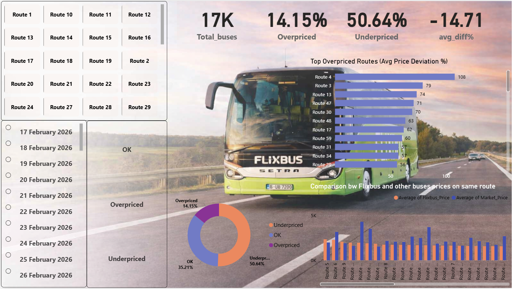

# 🚀 Dynamic Pricing Analysis & Competitor Benchmarking System

An end-to-end data-driven system to monitor, compare, and optimize bus pricing against competitors.

This project identifies whether a bus is **overpriced or underpriced** by benchmarking it against similar buses in the market and generates actionable pricing insights.

---

## 📌 Problem Statement

In a competitive transportation market, pricing decisions must be dynamic and data-driven.

The goal of this project is to:
- Identify **similar buses (competitors)**
- Compute **market price benchmarks**
- Detect **pricing inefficiencies**
- Automate **pricing monitoring & alerts**

---

## 🧠 Key Features

- 🔍 Smart **Competitor Matching Engine**
- 📊 **Market Price Calculation**
- 🚩 **Overpricing / Underpricing Detection**
- ⚡ Automated **Flagging System**
- 📈 Interactive **Power BI Dashboard**
- 🔄 Scalable **Automation Pipeline (MVP Design)**

---

## 🏗️ System Workflow

As shown in the system design (Automation Plan), the pipeline follows:

1. **Data Collection**
2. **Data Cleaning & Preparation**
3. **Feature Engineering**
4. **Identify Similar Buses**
5. **Calculate Market Price**
6. **Compare Prices**
7. **Confidence Check (Enough Competitors?)**
8. **Generate Insights / Flag Issues**
9. **Store Results & Visualize**

📌 The workflow diagram (see Automation Plan) highlights decision logic such as:
- If enough competitors exist → Generate insights
- Else → Mark as low confidence and skip/review

---

## ⚙️ Methodology

### 1. Identifying Similar Buses

Buses are grouped based on:

- Route
- Bus Type
- Departure Date

Similarity conditions:
- Departure time within **±60 minutes**
- Journey duration within **±30 minutes**

---

### 2. Market Price Calculation

- Competitor buses are filtered
- Market price = **Average competitor price**

---

### 3. Pricing Flag Logic

For each bus:

- Price Difference = Our Price – Market Price
- % Deviation calculated

🚩 Flags:
- **Overpriced** → Price significantly higher than market
- **Underpriced** → Price significantly lower than market

---

## 📊 Dashboard (Power BI)

The dashboard provides:

- Price comparison vs competitors
- % deviation visualization
- Route-level insights
- Outlier detection

### 📸 Dashboard Preview

---

## 🛠️ Tech Stack

| Component            | Tools Used |
|---------------------|-----------|
| Data Processing     | Python (Pandas, NumPy) |
| Data Storage        | CSV |
| Analysis            | Jupyter Notebook |
| Visualization       | Power BI |
| Automation (Planned)| Cron Jobs / Airflow |

---

## 🔄 Automation Plan (MVP)

As described in the automation document:

- Daily data ingestion
- Python-based processing pipeline
- Automated flag generation
- Storage in database / files
- Dashboard refresh
- Alert system (Email / Slack)

📌 Full automation workflow available in:
- `Automation Plan.pdf`

---

## 📈 Sample Insights

- Certain routes show consistent **overpricing trends**
- Late-night buses tend to have **less competition → higher variance**
- High demand routes show **tight price clustering**

---
